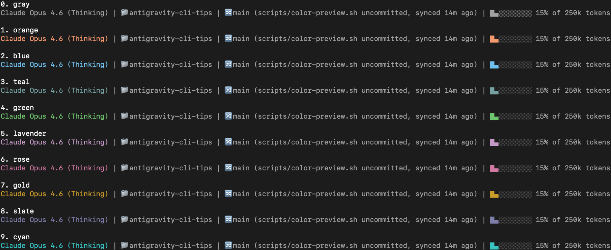

# Antigravity CLI tips

## Tip 0: Set up terminal aliases for quick access

To help you launch Antigravity CLI quickly, you can alias `agy` to just `a`.

To set this up, add this line to your shell config file (such as `~/.zshrc` or `~/.bashrc`):

```bash
alias a='agy'
```

I personally like to set up aliases for other tools I use often too, not just Antigravity. For example:

```bash
alias gb='github'  # GitHub Desktop
alias co='code'    # VS Code
```

## Tip 1: Set up your custom status line

You can customize the status line at the bottom of Antigravity CLI to show useful info (see the [official docs](https://antigravity.google/docs/cli-statusline)). For example, I built [this script](scripts/context-bar.sh) that shows the model, current directory, git branch, uncommitted file count, sync status with origin, and a visual progress bar for token usage:

```
Claude Opus 4.6 (Thinking) | 📁antigravity-cli-tips | 🔀main (scripts/color-preview.sh uncommitted, synced 14m ago) | █▄░░░░░░░░ 15% of 250k tokens
```

To set this up:

1. Copy the script to your Antigravity CLI config directory:
   ```bash
   mkdir -p ~/.gemini/antigravity-cli
   curl -o ~/.gemini/antigravity-cli/statusline.sh https://raw.githubusercontent.com/ykdojo/antigravity-cli-tips/main/scripts/context-bar.sh
   chmod +x ~/.gemini/antigravity-cli/statusline.sh
   ```

2. Add the following to your `~/.gemini/antigravity-cli/settings.json`:
   ```json
   {
     "statusLine": {
       "type": "command",
       "command": "~/.gemini/antigravity-cli/statusline.sh"
     }
   }
   ```

The script supports 10 color themes (orange, blue, teal, green, lavender, rose, gold, slate, cyan, or gray). Edit the `COLOR` variable at the top of the script to change it.



It also adapts to narrow terminals by wrapping at natural breakpoints instead of getting cut off:

```
Claude Opus 4.6 (Thinking) | 📁antigravity-cli-tips
 | 🔀main (scripts/context-bar.sh uncommitted, synced 11m ago)
 | ░░░░░░░░░░ 0% of 250k tokens
```

## Tip 2: Set up AGENTS.md

`AGENTS.md` is a file you place in your project root to give Antigravity CLI persistent instructions. Anything you write in it gets included in every prompt within that directory. It's great for things like coding conventions, project-specific rules, or how you want the agent to behave in general.

If you also use Claude Code, you can symlink `CLAUDE.md` to point to the same file so both tools share the same instructions:

```bash
ln -s AGENTS.md CLAUDE.md
```

You can also set up a global `AGENTS.md` at `~/.gemini/AGENTS.md` for instructions that apply across all projects.

## Tip 3: Talk to Antigravity CLI with your voice

I found that you can communicate much faster with your voice than typing with your hands. Using a voice transcription system on your local machine is really helpful for this.

On my Mac, I've tried a few different options:
- [superwhisper](https://superwhisper.com/)
- [MacWhisper](https://goodsnooze.gumroad.com/l/macwhisper)
- [Super Voice Assistant](https://github.com/ykdojo/super-voice-assistant) (open source, supports Parakeet v2/v3)

You can get more accuracy by using a hosted service, but I found that a local model is strong enough for this purpose. Even when there are mistakes or typos in the transcription, the AI is smart enough to understand what you're trying to say. Sometimes you need to say certain things extra clearly, but overall local models work well enough.

I think the best way to think about this is like you're trying to communicate with your friend. Of course, you can communicate through texts. But if you want to communicate faster, why wouldn't you get on a quick phone call? You can just send voice messages. It's faster, at least for me.

A common objection is "what if you're in a room with other people?" In that case, I just whisper using earphones - I personally like Apple EarPods (not AirPods). They're affordable, high quality enough, and you just whisper into them quietly. I've done it in front of other people and it works fine. In offices, people talk anyway - instead of talking to coworkers, you're talking quietly to your voice transcription system. This method works so well that it even works on a plane. It's loud enough that other people won't hear you, but if you speak close enough to the mic, your local model can still understand what you're saying.

## Tip 4: Master different ways of verifying its output

One way to verify its output if it's code is to have it write tests and make sure the tests look good and don't just hardcode true. That's one way, but you can of course check the code it generates as it goes. You can also use a visual Git client like GitHub Desktop for checking changes quickly. And having it generate a PR is a great way as well - have it create a draft PR, check the content before marking it as ready for review.

## Tip 5: Learn to use various CLI tools from the agent

For example, you can create a draft PR through the `gh` command, and once it's created, you can ask the agent to open it in your browser with the `open` command so you can review it yourself. If you have a change you want to check quickly or fix manually, you can use the `code` command to open it in VS Code, or use the `github` command to open GitHub Desktop and see a visual diff. You can use `ffmpeg` for quick video editing, or ImageMagick for quick image editing and conversion. There are a lot of things you can do if you're familiar with these CLI tools.

## Tip 6: Attach images with Ctrl+V

You can attach an image from your clipboard to your prompt by simply pressing Ctrl+V.

## Tip 7: Cmd+A and Ctrl+A are your friends

Sometimes you want to give Antigravity CLI a bunch of text from a webpage or terminal output. You can give it a URL, but another method is to just select all (Cmd+A on Mac, Ctrl+A on Windows/Linux), copy, and paste it directly into the CLI.

Some pages don't lend themselves well to select all by default - but there are tricks to get them into a better state first. For example, with Gmail threads, click Print All to get the print preview (but cancel the actual print). For YouTube videos, click "Show transcript" and then Cmd+A or Ctrl+A.

## Tip 8: Manage your to-do list in AGENTS.md

It's convenient to keep a to-do list or project status in your `AGENTS.md` file. Since the agent reads it with every prompt, you can just ask "what's on the to-do list?" and it'll know exactly where things stand. You can also ask it to update the list as you make progress.

For example, you might have a section like this in your `AGENTS.md`:

```markdown
## To-Do

### Done
- [x] Unity 3D URP project scaffold
- [x] Card hand UI with 7 cards at bottom of screen
- [x] Card hover effect (scale + blue outline highlight)
- [x] Card drag with placeholder in hand

### Up Next
- [ ] 3D world view - camera at an angled perspective looking down at a game field/board
```

Then you can just ask "what do we have for the to-do list" and it'll give you a summary of what's done and what's next.

## Tip 9: Pre-allow directories outside your project

By default, Antigravity CLI auto-allows reading and writing files inside your current project directory. But if you ask it to access files in a different directory, it'll prompt you for permission every time.

You can fix this by adding those directories to the `allow` list in your `~/.gemini/antigravity-cli/settings.json` (see the [official docs](https://antigravity.google/docs/cli-permissions)):

```json
{
  "permissions": {
    "allow": [
      "read_file(/Users/yk/Desktop/projects/massive-coop-roguelike)"
    ]
  }
}
```

Path matching is recursive, so allowing a directory covers all files and folders inside it. If you also want write access, add `write_file` too - and `write_file` implies `read_file`, so you don't need both for the same path.

## Tip 10: Use realpath to point it at files in a different location

When you want to tell Antigravity CLI about files in a different folder, use `realpath` to get the full absolute path:

```bash
realpath some/relative/path
```

Then paste that absolute path into your prompt so it knows exactly where to look.

## Tip 11: Skip permissions in isolated environments

If you're working in an isolated environment - like a container, a VM, or a dedicated test machine - where you're okay with the agent doing anything without asking, you can launch Antigravity CLI with:

```bash
agy --dangerously-skip-permissions
```

This auto-approves all tool permission requests without prompting. It's a session-level override, so your permission settings on disk stay unchanged (see the [official docs](https://antigravity.google/docs/cli/using)).

As the flag name suggests, this is dangerous - only use it in environments where you're comfortable with the agent taking any action without confirmation.

For convenience, you can even add an alias like in [Tip 0](#tip-0-set-up-terminal-aliases-for-quick-access):

```bash
alias as='agy --dangerously-skip-permissions'
```