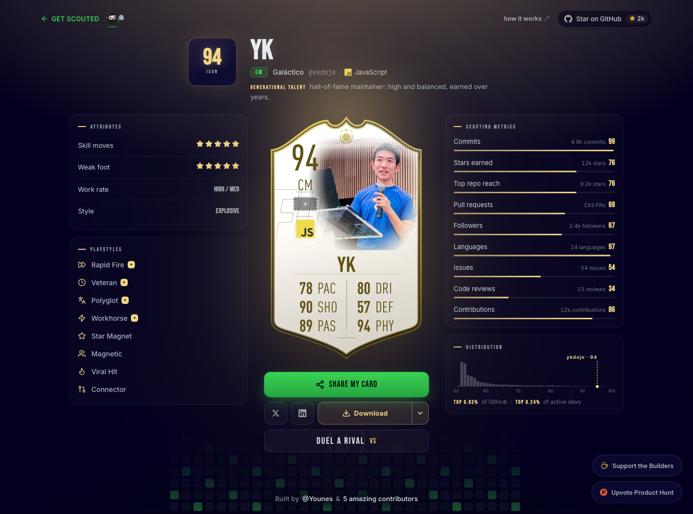
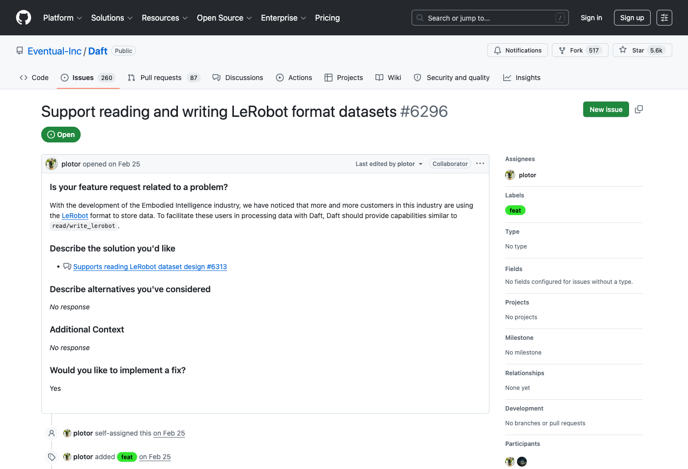
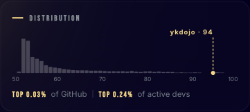
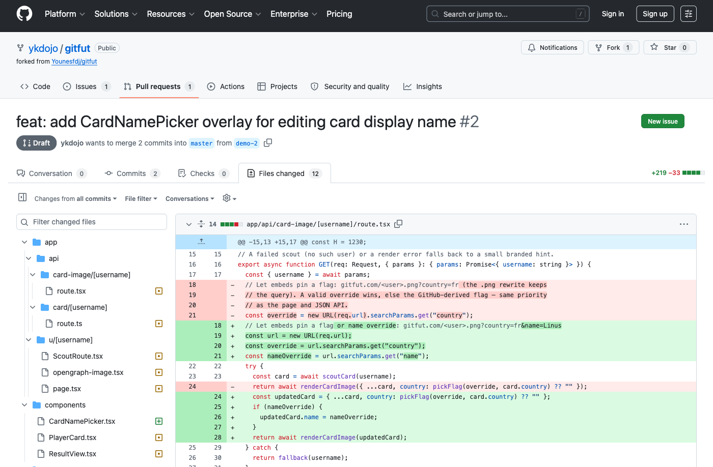

# Agentifying your entire software development lifecycle

*This is an adapted version of [this video](https://youtu.be/K3YYr6yauAw) on the Google Cloud Tech YouTube channel. The slides are available [here](https://ykdojo.github.io/antigravity-cli-tips/content/sdlc-slides.html).*

A common complaint about agentic coding is that people write more features with it, but they end up creating more bugs too. More code tends to naturally lead to more tech debt. Part of the reason we have this problem is that we tend to over-rely on agents to generate code, but not enough for maintaining it, reviewing it, or testing it.

That's the motivation behind this post. It walks through a simplified version of the software development lifecycle (SDLC):

1. Identify and understand the issue
2. Design a solution
3. Implement it
4. Review and test it

This doesn't cover all of SDLC, but it should be sufficient for this discussion. Let's go through these steps one by one.

## Step 1: Identifying and understanding the issue

I have two example issues to cover here.

The first one is simple enough that it doesn't have to be agentified, but it'll be important later. For context: if you go to gitfut.com/yourusername, you get a card with a score for your GitHub contributions and stats like commits and stars earned, similar to a football (soccer) trading card. The nice thing about it is that it's open source. I was looking through it and found an issue, which I [copied to my own fork](https://github.com/ykdojo/gitfut/issues/1) so I could work on it there. The problem this person had was that his last name is "De Ruwe" in two words, but his player card was only showing "Ruwe". It's short enough to just read yourself; we'll come back to it in step 3.

The second example is [an issue on Daft](https://github.com/Eventual-Inc/Daft/issues/6296), an open source data processing library I've been part of for a while. This one is fairly complex, and there's an attached discussion that's also complex on its own.

I could read it sentence by sentence myself, but a faster way to handle this part of the process is to hand it to a tool like Antigravity:

> Can you summarize this issue as well as the attached discussion and tell me what's going on? What's the problem exactly? What's the status?

This speeds up the process of identifying and understanding the issue. It's especially useful when there are a lot of discussions going on and a lot of attached PRs and issues.

Once the agent comes back with a summary, I go back and forth with it to dig into specific parts. For example, if the summary is long:

> You gave me a lot of information. It's a lot for me to read, so can you summarize it further? And also give me a summary of this PR that you mentioned, [7184](https://github.com/Eventual-Inc/Daft/pull/7184).

This is a process I use a lot: going back and forth with the agent to dig into certain issues or materials. I might also ask it to open certain pages so I can look into them myself.

## Step 2: Designing the solution

Back to the GitFut example (I'm not associated with the project in any way, just a fan). When I looked at my own card, I wondered: how good is this score really? What does the number actually mean? It would be convenient to see a distribution of GitHub users and where you rank in relation to them. So I decided to implement this feature and [sent a PR](https://github.com/Younesfdj/gitfut/pull/37). The idea is to add a new distribution tab, so you can see that you're in the top X% of all GitHub users and the top X% of active devs.

This required designing a couple of things. The visual look was relatively trivial compared to the system side: how do you gather this data in a privacy-friendly way? How do you store it? How do you show it?

For that, I had a long conversation with a coding agent, asking questions like: what's a good way to fetch all the data? Can I fetch 20,000 accounts? It turns out I could. In the end, I fetched about 20,000 accounts and stored them in a privacy-friendly, anonymized way in the code itself, so it's efficient. I also looked at how many of those accounts were active in the past year. You can look at the PR itself to see how it was implemented. This bleeds a little into implementation, but it's an example where an agentic process for this part of the SDLC was really helpful.

## Step 3: Implementing it

Now let's go back to the name issue from step 1 and implement a fix.

To recap: this person's last name is "De Ruwe" in two words, but the card only showed "Ruwe", because the app assumed the last word of your full name is your last name. The original project ended up fixing this by treating the last two words as the last name instead. But that heuristic isn't always right either. I have a middle name, for example, so if I had my full name on my GitHub account, the card would incorrectly show my middle name as part of my last name.

I would solve it differently: instead of guessing, make the name customizable. The issue reporter actually suggested this approach himself. GitHub only has a single setting for your full name, so let the user change how their name appears on the card, the same way they can already pick a country. The country selector works through a URL parameter: if I pick Canada on my card, the URL gets `?country=CA`, and anyone opening that URL sees the card with a Canadian flag. Remove the parameter and the flag is gone. The name can work exactly the same way, which I think is a reasonable approach.

At this point, I've identified the problem and designed a solution, so I can start implementing. I take the URL of the repo I'm working on (in this case my fork, so I don't affect the original project) and prompt something like:

> I'm working on this repository. It is a fork, so make sure to stay on this fork. I'm not sure if it's cloned yet. If not, you can clone it. If it's already cloned, pull the latest version and switch to the main or master branch.

I keep all my Antigravity projects in a single projects folder, so it knows where to look for them. Then I describe the issue:

> I'm working on this issue. The way I want to work on it is I want it to be like the country selector. If you look at the country selector, you can hover over it on anyone's card, select a country, and that's stored in the URL parameter. Can we do the same thing for the name? For the name within the card, maybe there's an overlay element I can hover over and edit the name to whatever I want, so that it's also stored in the URL parameter.

That's the kind of prompt I would use for this task. One small tip: I didn't remember the command for running the project locally, so I just asked Antigravity:

> I've been working on this project, but I forgot how to run it. Was it npm run dev? Remind me, and actually run it for me so I can check it.

It looked at package.json, confirmed the command, and ran it for me.

The end result: there's now an edit option on the card itself, and the custom name is stored in a URL parameter, just like the country. If the person from the issue wants his full last name to show up, he can simply set it. To me, this is the most flexible and comprehensive solution, instead of trying to be smart about which part is the last name exactly. Maybe I just want to use my first name only, or my nickname.

## Step 4: Reviewing and testing

For this step, I have [the complete version of the PR](https://github.com/ykdojo/gitfut/pull/2) I was just working on. The title and description were all generated agentically, and there are quite a few changed files.

Suppose someone else on my team created this PR, or I created it and forgot about it a little bit, and I want to review it before sending it out. You could review everything manually, but I've found an interactive way of reviewing to be pretty effective:

> I have this PR that I want to review. I see that there are a lot of files that changed. Can you summarize each one for me so I can review them one by one? Keep each summary to one or two sentences so that it's easy to review.

Antigravity fetches the information from GitHub (or wherever you host your code) directly and summarizes each file. Then I go through them one by one. If a summary is good enough and the change makes sense, I mark that file as viewed. If something surprises me, like a sharing utility file that changed for reasons I don't quite understand when I look at it manually, I can say:

> I don't quite understand this part. Can you explain this line by line?

Then I copy and paste the relevant parts of the codebase.

There's a question about craft here: how much of the code do you need to understand? How much do you want to understand? To me, this is the answer. You don't necessarily have to understand everything manually, but you have to know there's always an option to dig in with however much depth you need, line by line if necessary. Tools like Antigravity are helpful for speeding up the process. It doesn't mean you lose control of your code. On the contrary, I think you gain more control by being able to dig into any part of the codebase more easily.

## Wrapping up

That's the entire (simplified) SDLC, agentified.

If you want more tips like this, check out the rest of [this repo](../README.md), and you can watch the full video version of this post [here](https://youtu.be/K3YYr6yauAw).
